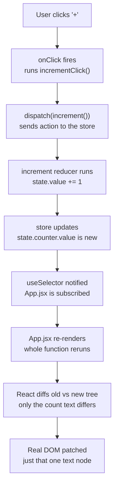

# Redux Toolkit — Counter + Theme
##  For Documentation and quick revision of Redux setup and workarounds based on specfic project done

Two independent slices, one store. Quick reference for revision.

**Live:** (https://redux-toolkit-app-omega.vercel.app/)

```
counterSlice ─┐
              ├─▶ store ─▶ <Provider> ─▶ App.jsx (useSelector / useDispatch)
themeSlice   ─┘
```

---
# Redux setup steps for slices, store, main.jsx, app.jsx:

## Step-1. Store.js — empty shell first

```js
// see redux doc site for easy copy paste
import { configureStore } from '@reduxjs/toolkit'

export const store = configureStore({
  reducer: {
    // mapping a global state key to a slice reducer function
  },
})
```

---

## Step-2. Wrap App in `<Provider>`

```jsx
// see redux doc site for easy copy paste
import { Provider } from 'react-redux'
import { store } from './store.js'

createRoot(document.getElementById('root')).render(
  <StrictMode>
    <Provider store={store}>
      <App />
    </Provider>
  </StrictMode>,
)
```

This is what makes state **global** — any component inside `<App />` can reach the store.

---

## Step-3. counterSlice.js (define relevant reducer functions)

```js
import { createSlice } from '@reduxjs/toolkit'

const counterSlice = createSlice({
  name: 'countfunctions',
  initialState: { value: 0 },
  reducers: {
    increment: (state) => { state.value += 1 },
    decrement: (state) => { if (state.value > 0) state.value -= 1 },
    increaseByAmt: (state, action) => { state.value += Number(action.payload) },
  },
})

export const { increment, decrement, increaseByAmt } = counterSlice.actions
export default counterSlice.reducer
```

---

## Step-4. themeSlice.js (define relevant reducer functions)

```js
import { createSlice } from '@reduxjs/toolkit'

const themeSlice = createSlice({
  name: 'themes',
  initialState: { darkMode: false },
  reducers: {
    toggleTheme: (state) => { state.darkMode = !state.darkMode },
  },
})

export const { toggleTheme } = themeSlice.actions
export default themeSlice.reducer
```

---

## Step-5. Register both slices in store.js

```js
import counterSliceReducer from './features/counterSlice'
import toggleThemeReducer from './features/themeSlice'

export const store = configureStore({
  reducer: {
    counter: counterSliceReducer,
    theme: toggleThemeReducer,
  },
})
```

---

## Step-6. Import both slices in App.jsx, define functions that utilizes reducer functions

```jsx
const dispatch = useDispatch()
const countDisplay = useSelector((state) => state.counter.value)
const darkMode = useSelector((state) => state.theme.darkMode)

const incrementClick = () => dispatch(increment())
const toggleThemeClick = () => dispatch(toggleTheme())
```


---

## Remember
- `useSelector` reads **and** subscribes — that's why UI updates automatically.
- No payload → just flips/sets a fixed value (`toggleTheme`). Payload → carries data in (`increaseByAmt`).
- Redux stores facts only. Styling/DOM decisions happen in the component (`darkMode ? a : b`).
- `e.target.value` is always a string — wrap in `Number()` before math.

---

## How things works? Assume user  click "+" then program flow is as:



**The two steps people usually skip past:**
- Store updating does **not** touch the DOM directly — it just notifies subscribed components.
- React doesn't patch the DOM directly from the reducer either — the whole `App` function reruns first, then React diffs the new output against the old and only touches what actually changed.
